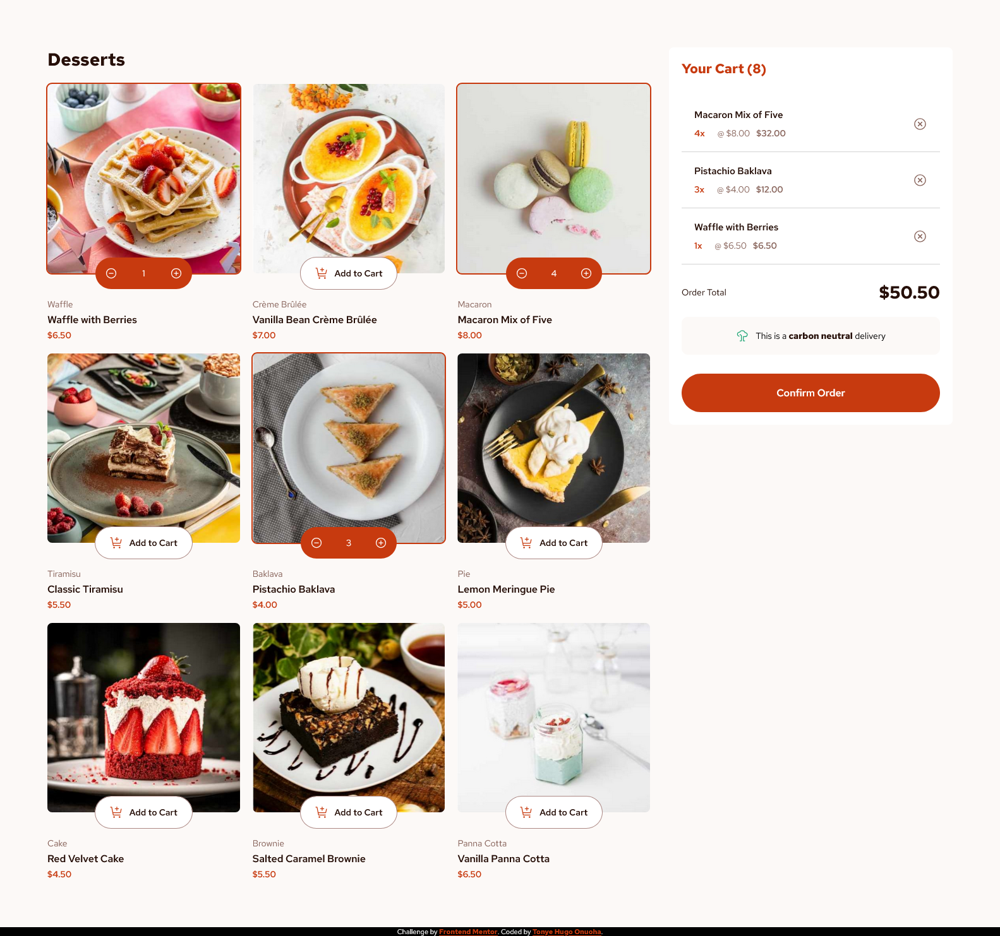

# Frontend Mentor - Product list with cart solution

This is a solution to the
[Product list with cart challenge on Frontend Mentor](https://www.frontendmentor.io/challenges/product-list-with-cart-5MmqLVAp_d).
Frontend Mentor challenges help you improve your coding skills by building realistic projects.

## Table of contents

-   [Overview](#overview)
    -   [Screenshot](#screenshot)
    -   [Links](#links)
-   [My process](#my-process)
    -   [Built with](#built-with)
    -   [Useful resources](#useful-resources)
-   [Author](#author)

## Overview

This is a React + Vite project in which the main objective is to build out a "Product list with cart" solution.

### Screenshot

### Links

-   Live Site URL: [Vercel](https://product-list-with-cart-one-silk.vercel.app)

## My process

The process was very straightforward. I started by writing out the necessary components of the project. I then broke
down the styling of components one piece at a time using CSS with the grid and flexbox layout model, while also
following the mobile-first approach. To complete the layout, I then proceeded to write the media queries for the desktop
design.

### Built with

-   Semantic HTML5 JSX markup
-   CSS custom properties
-   Flexbox layout model
-   Grid layout model
-   Media queries

### Useful resources

-   [W3Schools](https://www.w3schools.com/)
-   [MDN](https://developer.mozilla.org/)

## Author

-   Email Address - [tonyeonuoha@gmail.com](tonyeonuoha@gmail.com)
